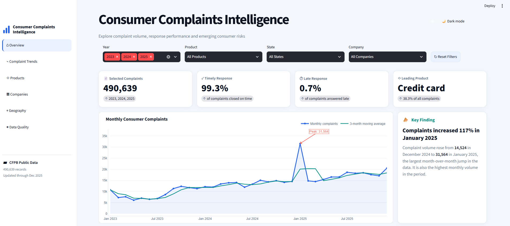
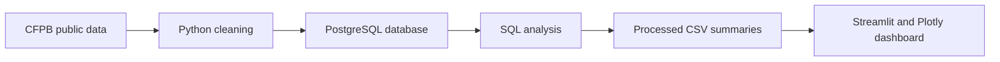
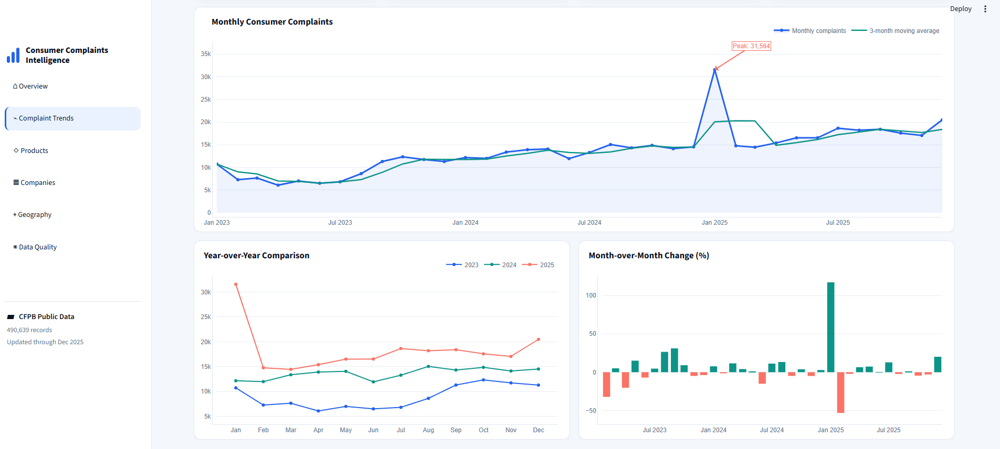
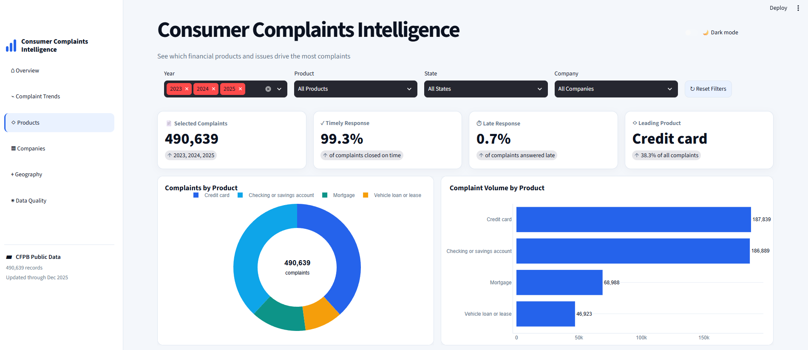
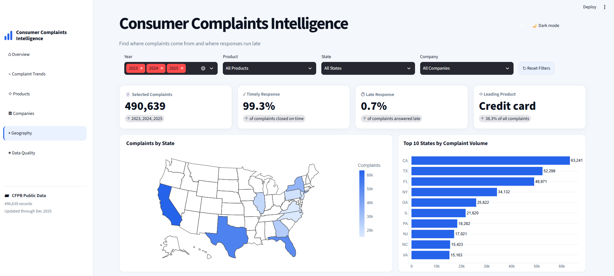
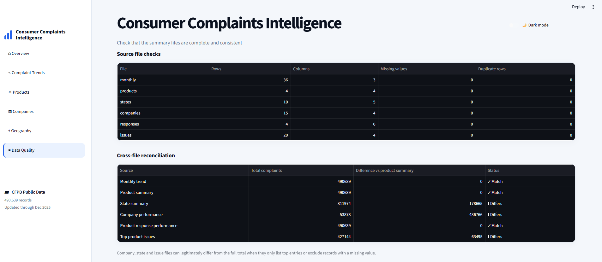
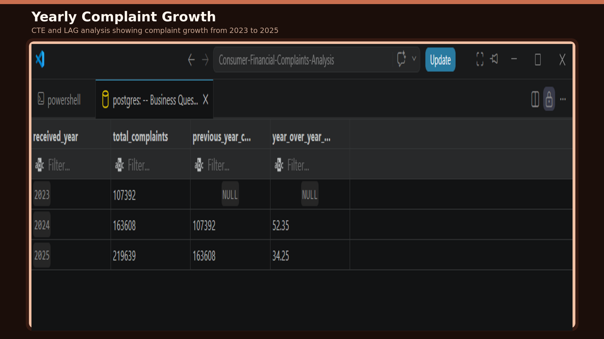
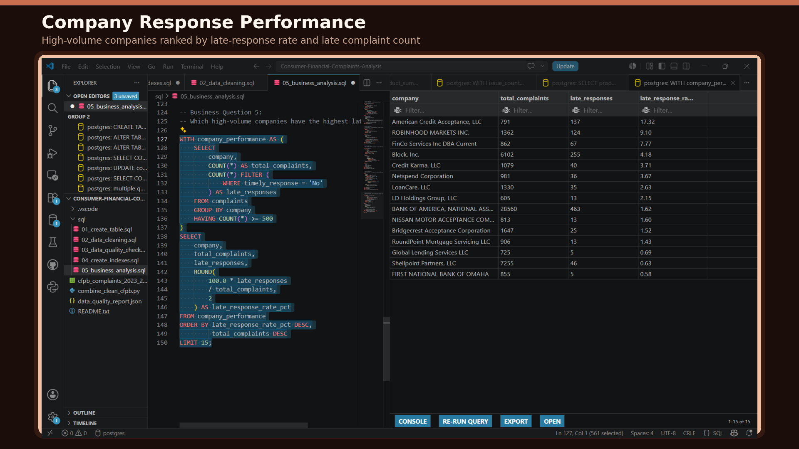
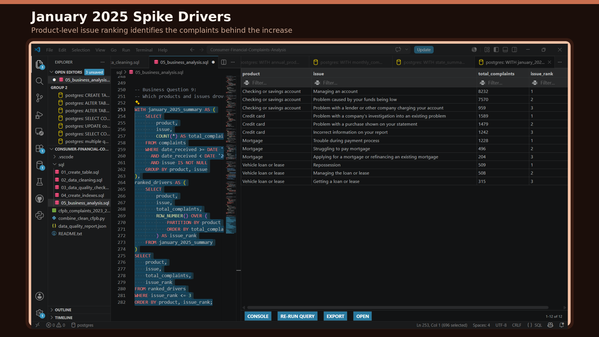

# Consumer Financial Complaints Intelligence

An end-to-end data analytics project examining consumer complaints submitted to the U.S. Consumer Financial Protection Bureau (CFPB). The project combines public data, Python cleaning, PostgreSQL analysis, data-quality validation, and an interactive Streamlit dashboard.



## Project Overview

This project analyzes **490,639 consumer complaints** received between **January 2023 and December 2025** across four major financial products:

- Credit cards
- Checking or savings accounts
- Mortgages
- Vehicle loans or leases

The analysis focuses on complaint volume, product concentration, company response performance, geographic patterns, and unusual changes over time.

## Business Problem

Financial institutions and consumer-protection teams need to understand where complaints are increasing, which products generate the most dissatisfaction, and whether companies respond on time. Raw complaint records are too large and detailed for quick decision-making, so the data must be cleaned, validated, summarized, and presented through an accessible analytical interface.

## Project Objectives

- Build a reliable analytical dataset from official CFPB complaint records.
- Identify trends, spikes, and changes in complaint volume.
- Compare complaint distribution across products, companies, and states.
- Measure timely and late company-response rates.
- Use SQL techniques such as CTEs, window functions, rankings, and moving averages.
- Create an interactive dashboard for business users and portfolio reviewers.
- Document data-quality checks and analytical limitations.

## Features

- Interactive filters for year, product, state, and company
- Light and dark display modes
- KPI cards for complaint volume and response performance
- Monthly trend and three-month moving average
- Year-over-year and month-over-month comparisons
- Product and complaint-issue analysis
- Company response-performance analysis
- U.S. state complaint map and state ranking
- Data-quality and cross-file reconciliation page

## Technology Stack

| Area | Tools |
|---|---|
| Data source | CFPB Consumer Complaint Database |
| Data cleaning | Python, pandas |
| Database | PostgreSQL |
| SQL analysis | CTEs, joins, window functions, ranking, moving averages |
| Data processing | Python, pandas |
| Visualization | Streamlit, Plotly |
| Development | VS Code, PowerShell, Git, GitHub |

## Architecture



## Dataset

**Source:** [CFPB Consumer Complaint Database](https://www.consumerfinance.gov/data-research/consumer-complaints/)

| Detail | Coverage |
|---|---:|
| Date range | 2023-01-01 to 2025-12-31 |
| Records analyzed | 490,639 |
| Financial products | 4 |
| Data type | Complaint-level public records |

The dataset includes complaint dates, products, issues, companies, states, response status, and whether the company responded on time.

> **Data availability:** The complete cleaned complaint-level CSV is approximately 143 MB and is not committed because it exceeds GitHub's individual file-size limit. The reproducible cleaning script, data-quality report, SQL files, and small processed dashboard summaries are included.

## Data Cleaning

The Python cleaning process:

1. Combined multiple CFPB extracts into one dataset.
2. Standardized column names using `snake_case`.
3. Converted date fields into consistent date formats.
4. Added year, month number, month label, and year-month fields.
5. Removed duplicate complaint IDs.
6. Standardized blank and missing values.
7. Cleaned state values and other inconsistent categorical fields.
8. Validated row counts, date coverage, and complaint-ID uniqueness.
9. Exported a PostgreSQL-ready CSV file.

## SQL Analysis

The PostgreSQL analysis answers business questions such as:

- How did complaint volume change from 2023 to 2025?
- Which products account for the largest share of complaints?
- Which issues occur most frequently within each product?
- Which companies receive the most complaints?
- Which companies have the highest late-response rates?
- Which states report the largest complaint volumes?
- What is the monthly complaint trend and three-month moving average?
- Which products drove the January 2025 complaint spike?

The SQL work demonstrates:

- Common table expressions
- Aggregate functions
- Conditional aggregation
- Window functions
- `RANK()` and `ROW_NUMBER()`
- Three-month moving averages
- Year-over-year comparisons
- Data-quality and reconciliation checks

## Python Analysis

Python and pandas were used to transform the SQL outputs into reusable summary files for the dashboard:

- `monthly_trend.csv`
- `product_summary.csv`
- `state_summary.csv`
- `company_performance.csv`
- `product_response_performance.csv`
- `top_product_issues.csv`

Plotly powers the interactive charts, while Streamlit manages filters, layout, themes, and dashboard navigation.

## AI Integration

The core findings are based on reproducible SQL and Python calculations, not AI-generated results. A future version could add a natural-language assistant that translates user questions into approved analytical queries and explains dashboard findings in plain language.

## Example Questions

- Which financial product generates the most complaints?
- How has complaint volume changed over time?
- Which companies have the highest late-response rates?
- Where are consumer complaints most concentrated geographically?
- What caused the January 2025 increase in complaint volume?
- Are the dashboard summaries consistent with the full dataset?

## Example Insights

- **Credit cards represented 38.3% of all selected complaints**, making them the leading complaint category.
- **99.3% of complaints received a timely company response**, while approximately **0.7%** were answered late.
- Monthly complaints increased from **14,524 in December 2024 to 31,564 in January 2025**, an increase of approximately **117%**.
- January 2025 recorded the highest monthly complaint volume in the analysis period.
- California recorded the largest state-level complaint volume in the dashboard dataset.

## Dashboard Screenshots

### Complaint Overview


### Complaint Trends



### Product Analysis



### Geographic Analysis



### Data-Quality Validation



## Selected SQL Evidence

### Yearly Complaint Growth



### Company Response Performance



### January 2025 Spike Drivers



## Project Structure

```text
Consumer-Financial-Complaints-Analysis/
├── .gitignore
├── app.py
├── combine_clean_cfpb.py
├── data_quality_report.json
├── requirements.txt
├── README.md
├── data/
│   ├── README.md
│   └── processed/
├── docs/
│   └── business_case.md
├── sql/
│   ├── 01_create_table.sql
│   ├── 02_data_cleaning.sql
│   ├── 03_data_quality_checks.sql
│   ├── 04_create_indexes.sql
│   └── 05_business_analysis.sql
└── screenshots/
```

## How to Run Locally

### 1. Clone the repository

```bash
git clone https://github.com/austinechi1/Consumer-Financial-Complaints-Analysis.git
cd Consumer-Financial-Complaints-Analysis
```

### 2. Create and activate a virtual environment

```bash
python -m venv .venv
```

On Windows PowerShell:

```powershell
.venv\Scripts\Activate.ps1
```

### 3. Install the dependencies

```bash
python -m pip install -r requirements.txt
```

### 4. Start the dashboard

```bash
python -m streamlit run app.py
```

Streamlit will display the local dashboard address in the terminal.

## Future Improvements

- Deploy the dashboard through Streamlit Community Cloud.
- Add an automated CFPB data-refresh pipeline.
- Connect the dashboard directly to PostgreSQL.
- Add statistical anomaly detection for unusual complaint spikes.
- Add a controlled natural-language analytics assistant.
- Expand the project to include additional financial products and more recent data.

## Author

**Nwachukwu Austine**  
Data and Business Analyst

- GitHub: [austinechi1](https://github.com/austinechi1)
- Portfolio: [austinechi1.github.io](https://austinechi1.github.io/)

## Disclaimer

This project is for educational and portfolio purposes. The dataset is public CFPB data. Findings should be interpreted in the context of submitted complaints and do not represent all consumer experiences or verified company wrongdoing.
