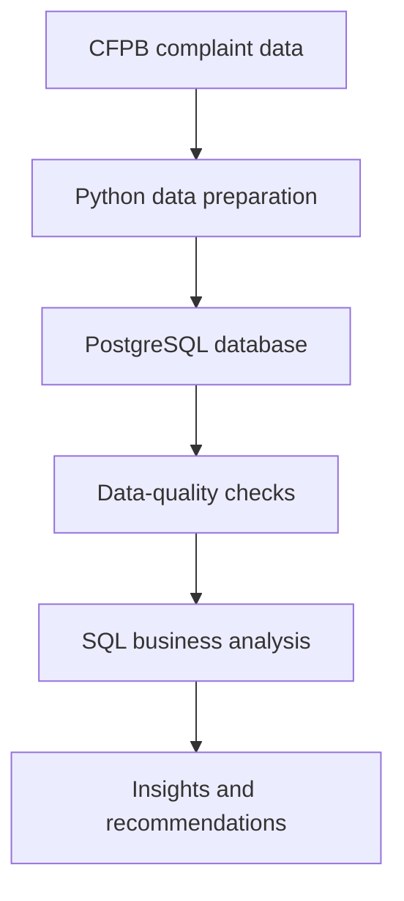

# Consumer Financial Complaints Analysis

## Project Overview

This project analyzes 490,639 consumer complaints submitted to the Consumer Financial Protection Bureau between January 2023 and December 2025.

The analysis focuses on four financial product categories:

- Checking or savings accounts
- Credit cards
- Mortgages
- Vehicle loans or leases

PostgreSQL was used to clean, validate and analyze the data using joins, common table expressions, filtered aggregations and window functions.

## Business Problem

Financial institutions receive large volumes of consumer complaints covering different products, issues, companies and locations. Without structured analysis, decision-makers may struggle to identify:

- Which products generate the most complaints
- Which issues affect customers most frequently
- Whether complaint volumes are improving or worsening
- Which companies have poor response performance
- Which locations experience the greatest complaint volumes
- What caused unusual increases in complaints

This project converts the raw complaint records into findings that can support operational improvements, customer-service planning and regulatory monitoring.

## Stakeholders

The primary stakeholders are:

- Customer experience managers
- Compliance and risk teams
- Operations managers
- Product managers
- Senior leadership
- Regulatory analysts

## Stakeholder Needs

Stakeholders need a reliable way to:

1. Monitor complaint volume over time.
2. Compare complaint performance across financial products.
3. Identify recurring customer problems.
4. Evaluate company response timeliness.
5. Detect sudden increases in complaint activity.
6. Prioritize products, companies and issues requiring intervention.

## Project Objectives

- Clean and validate the complaint dataset.
- Measure annual and monthly complaint trends.
- Rank products by complaint volume and market share.
- Identify the leading issues within each product.
- Compare timely-response performance across products and companies.
- Identify geographic complaint concentrations.
- Investigate the January 2025 complaint spike.
- Produce practical recommendations based on the findings.

## Business Questions

1. How has complaint volume changed from 2023 to 2025?
2. Which products account for the largest share of complaints?
3. What are the five most common issues within each product?
4. Which products have the strongest and weakest response performance?
5. Which high-volume companies have the highest late-response rates?
6. How has each product’s complaint volume changed year over year?
7. What patterns appear in the monthly complaint trend?
8. Which states generate the most complaints?
9. Which products and issues caused the January 2025 spike?

## Analysis Process

## Key Findings

### Complaint Growth

Complaint volume increased every year:

- 2023: 107,392 complaints
- 2024: 163,608 complaints, an increase of 52.35%
- 2025: 219,639 complaints, an increase of 34.25%

Growth slowed during 2025, but overall complaint volume continued to rise significantly.

### Product Concentration

Credit cards and checking or savings accounts generated most complaints:

- Credit cards: 187,839 complaints, 38.28%
- Checking or savings accounts: 186,889 complaints, 38.09%
- Mortgages: 68,988 complaints, 14.06%
- Vehicle loans or leases: 46,923 complaints, 9.56%

The two leading products accounted for 76.37% of all complaints.

### Leading Customer Issues

The most common issue within each product was:

- Checking or savings: Managing an account
- Credit cards: Problems with purchases shown on statements
- Mortgages: Trouble during the payment process
- Vehicle loans or leases: Managing the loan or lease

### Response Performance

All four product categories recorded timely-response rates above 98%.

- Credit cards: 99.73%
- Checking or savings accounts: 99.27%
- Mortgages: 98.77%
- Vehicle loans or leases: 98.54%

Vehicle loans or leases had the lowest timely-response rate, while mortgage complaints took the longest average time to reach companies.

### Company Performance

Among companies receiving at least 500 complaints, American Credit Acceptance recorded the highest late-response rate at 17.32%.

Bank of America recorded 463 late responses. Although its late-response rate was lower at 1.62%, its large complaint volume created a considerable number of affected customers.

### Geographic Concentration

California, Texas and Florida generated the largest complaint volumes. Together, they represented approximately 33.71% of complaints with valid two-letter state codes.

These figures represent total complaint volume and are not adjusted for state population.

### January 2025 Spike

January 2025 recorded 31,564 complaints. The increase was primarily driven by checking or savings account complaints:

- Managing an account: 8,232 complaints
- Problems caused by funds being low: 7,570 complaints
- Problems with charges applied to an account: 959 complaints

The first two issues alone represented approximately half of all complaints received during January 2025.

## Recommendations

1. Prioritize checking-account management and insufficient-funds processes because they were the main causes of the January 2025 spike.
2. Investigate credit-card purchase disputes and complaint-investigation procedures.
3. Review late-response workflows at companies with high complaint volumes or unusually high late-response rates.
4. Improve mortgage complaint routing to reduce the average time required to send complaints to companies.
5. Create automated monthly monitoring for unusual complaint increases.
6. Use complaint rates per customer or per state population when the required denominator data becomes available.
7. Track complaint resolution outcomes in addition to response timeliness.

## Limitations

- Complaint volume does not represent the total number of customers using each product.
- State comparisons are not adjusted for population.
- A complaint does not automatically confirm that a company violated a regulation.
- Some fields contained missing or inconsistent values.
- The analysis covers only the four selected product categories.
- The available data measures whether a response was timely, but not whether the customer considered the resolution satisfactory.

## Success Measures

Future improvements should be evaluated using:

- Reduction in recurring complaint issues
- Reduction in late-response rates
- Shorter complaint-routing times
- Faster identification of unusual complaint spikes
- Improved consistency across products and companies